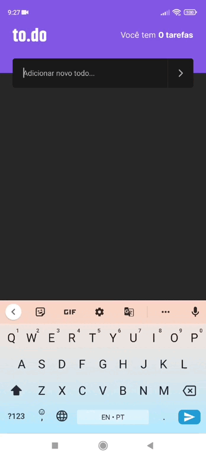

<h1 align="center">
    
</h1>

<p align="center">
  <a href="#technologies">Technologies</a>&nbsp;&nbsp;&nbsp;|&nbsp;&nbsp;&nbsp;
  <a href="#getting-started">Getting started</a>&nbsp;&nbsp;&nbsp;|&nbsp;&nbsp;&nbsp;
  <a href="#project">Project</a>
</p>

<br>

<p align="center">
  
</p>

---

## Technologies

This project was developed using the following technologies:

- [React Native](https://reactnative.dev/)
- [TypeScript](https://www.typescriptlang.org/)

## Getting started

Clone the project and access the folder

```bash
$ git clone https://github.com/HelvioFilho/ignite-desafio-conceitos && cd ignite-desafio-conceitos
```

Follow the steps below
```bash
# Install the dependencies
$ yarn
```
Android
```bash
# Start the project android
$ yarn android start 
```
IOS
```bash
# Start the project IOS
$ cd ios
$ pod install
$ cd ..
$ yarn ios start 
```

## Project

Project created to implement a challenge proposed by the rocketSeat team.
To.do is a task management app, you can add, delete, edit and mark tasks as done.
